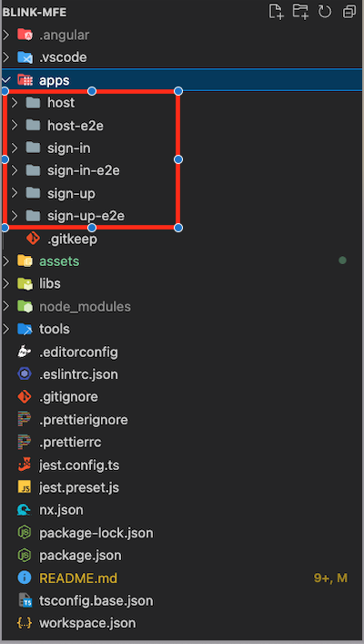
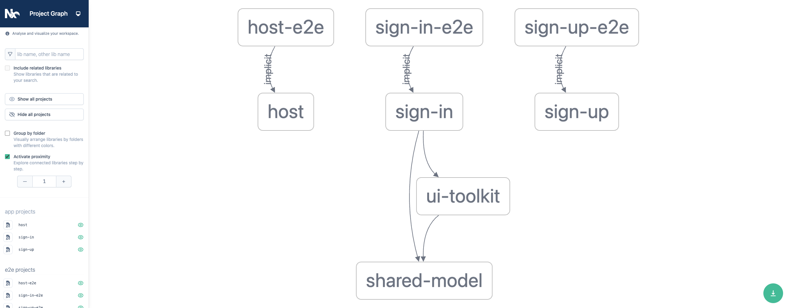

# Microfrontends
## Nx + Angular + Monorepo + Module Federations

[]()

## Features
- Monorepo
- Micro frontends
- Ui library
## Nx
https://nrwl.io/
Optimize and modernize your development practices

## Environment
    Angular CLI: 13.3.5
    Node: 14.19.2
    Package Manager: npm 6.14.17
    OS: darwin x64

    @angular-devkit/architect    0.1303.5 (cli-only)
    @angular-devkit/core         13.3.5 (cli-only)
    @angular-devkit/schematics   13.3.5 (cli-only)
    @schematics/angular          13.3.5 (cli-only)
## Installation

### We create an empty workspace
```
npx create-nx-workspace blink-mfe --preset=empty
```
### Install angular as a framework
```
npm install --save-dev @nrwl/angular
```

### Next, we generate the container application and the remote applications.
```
nx g @nrwl/angular:host host --remotes=sign-in,sign-up
```

### After installing the apps, you will see the following folder structure
[]()

### Now we can run the host container with static applications
```
nx serve host --devRemotes=sign-in,sign-up
```

## Build applications
```
nx build sign-in
nx build sign-up
```

### Run in production environment
To simulate a production deployment and host the applications independently, we must install a library that can serve the applications.

```
npm install -g http-server
```

#### deploy sign-in to local http-server
```
http-server -p 8081 --cors -c-1 ./dist/apps/sign-in
```

#### deploy sign-up to local http-server
```
http-server -p 8082 --cors -c-1 ./dist/apps/sign-up
```

> Note: `pay attention to each http port,` these are needed to configure the host application in `module-federation.config.js file`

## Go to config webpack.prod.config in host applications

##### ./apps/host/module-federation.config.js

```
    const { withModuleFederation } = require('@nrwl/angular/module-federation');
    const config = require('./module-federation.config');
    module.exports = withModuleFederation({
      ...config,
      remotes: [
        ['sign-in', 'http://127.0.0.1:8081'],
        ['sign-up', 'http://127.0.0.1:8082'],
      ]
    });
```
## Run all application with Production environment
```
    http-server -p 8080 --cors -c-1 ./dist/apps/host
    http-server -p 8081 --cors -c-1 ./dist/apps/sign-in
    http-server -p 8082 --cors -c-1 ./dist/apps/sign-up
```
# Now it is possible to see all running applications

======================================================

# Now let's create and share the library across all apps
```
npx nx generate @nrwl/workspace:library shared-module --no-interactive
```
### After creating the shared-model, you will see the following folder structure
```
...
+-- apps
|   > host
|   > sign-in
|   > sign-up
...
+-- libs
|   > shared-model
```

### Now we can use the model by another app, in this case we choose sign-in application
> and now we will try a command offered by nw to know which application has the shared-model library as a dependency
```
    nx affected:graph
```
> note `When the browser with the graphics opens, click the show affected projects button to see the library's dependency on other projects`

## Now is time to create and share the UI-toolkit library
```
npx nx g @nrwl/angular:library ui-toolkit --no-interactive
```

## Now we can add component ui to the UI-toolkit library
```
npx nx g @nrwl/angular:component button --project=ui-toolkit --no-interactive --export
```

### Take a look at what the dependency tree looks like
```
nx affected:graph
```
[]()
